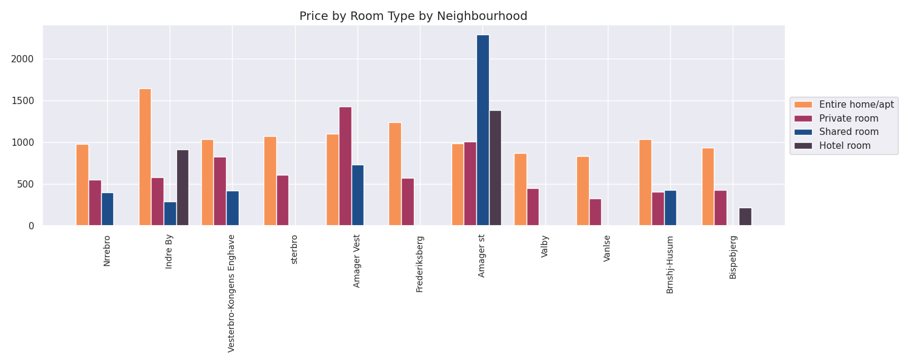
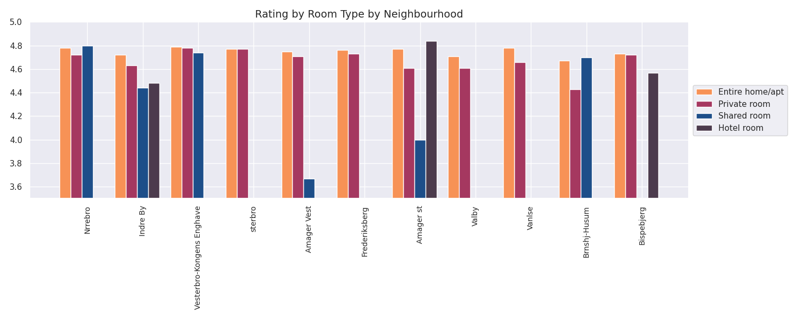
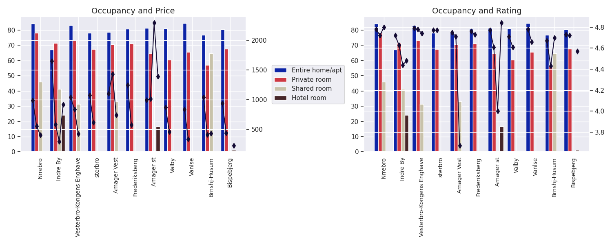

# Set Up

With Python 3.x installed, these are the steps to follow to set up the project.

## Virtual Environment

In order to avoid issues with the dependencies, we set up the virtual environment. To do that run the following command from your terminal while on the root of the project:

`python -m venv venv`

Alternatively, if you have multiple versions of python installed is probably that `python` points to something like Python 2.7 and `python3` points to Python 3.x. In that case run:

`python3 -m venv venv`

Once the virtual environment is set up, activate it by running:

`source venv/bin/activate` (on Linux/MacOS)

`.\venv\Scripts\Activate.ps1` (on Windows)

If successful, you should see a `(venv)` at the beginning of the prompt on your terminal.

After that, upgrade the `pip` version on that virtual environment by running:

`pip install --upgrade pip`

## Install dependencies

The dependencies needed for this project are listed in `requirements.txt`, to install them make sure that you are on the virtual environment and simply run:

`pip install -r requirements.txt`

## Run

While in the virtual environment, run `python main.py` depending on your system.

# Data structure to read (JSON):

```json
{
    "neighbourhood_1": {
        "room_type_1": {
            "availability_sum": <number>,
            "price_sum": <number>,
            "rating_sum": <number>,
            "counter": <number>
        },
        "room_type_2": {
            "availability_sum": <number>,
            "price_sum": <number>,
            "rating_sum": <number>,
            "counter": <number>
        },
        "room_type_3": {
            "availability_sum": <number>,
            "price_sum": <number>,
            "rating_sum": <number>,
            "counter": <number>
        }
    },
    "neighbourhood_2": {
        "room_type_1": {
            "availability_sum": <number>,
            "price_sum": <number>,
            "rating_sum": <number>,
            "counter": <number>
        },
        "room_type_2": {
            "availability_sum": <number>,
            "price_sum": <number>,
            "rating_sum": <number>,
            "counter": <number>
        },
        "room_type_3": {
            "availability_sum": <number>,
            "price_sum": <number>,
            "rating_sum": <number>,
            "counter": <number>
        }
    },
    .
    .
    .
}
```

# Data structure procesed (JSON):

```json
{
    "neighbourhoods": [
        "neighbourhood_1",
        "neighbourhood_2",
        "neighbourhood_3",
        .
        .
        .
    ],
    "room_type_1_occupancy": [
        <number>,
        <number>,
        <number>,
        .
        .
        .
    ],
    "room_type_1_price": [
        <number>,
        <number>,
        <number>,
        .
        .
        .
    ],
    "room_type_1_rating": [
        <number>,
        <number>,
        <number>,
        .
        .
        .
    ],
    "room_type_2_occupancy": [
        <number>,
        <number>,
        <number>,
        .
        .
        .
    ],
    "room_type_2_price": [
        <number>,
        <number>,
        <number>,
        .
        .
        .
    ],
    "room_type_2_rating": [
        <number>,
        <number>,
        <number>,
        .
        .
        .
    ],
    "room_type_3_occupancy": [
        <number>,
        <number>,
        <number>,
        .
        .
        .
    ],
    "room_type_3_price": [
        <number>,
        <number>,
        <number>,
        .
        .
        .
    ],
    "room_type_3_rating": [
        <number>,
        <number>,
        <number>,
        .
        .
        .
    ],
    .
    .
    .
}
```

# Questions

1. What is the average price for each room type on each neighbourhood?



2. What is the average rating for each room type on each neighbourhood?



3. What is the average occupancy for each room type on each neighbourhood?
* * How does the occupancy relate with the pricing?
* * How does the occupancy relate with the rating?

